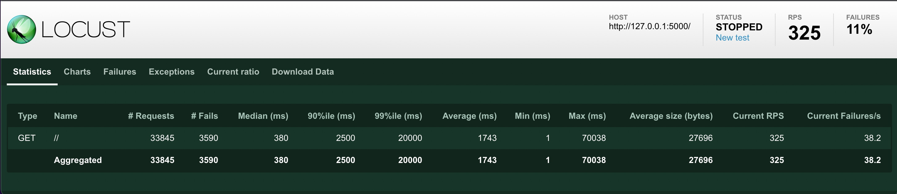

# Book Recommendation System
#### Team Members: Abhilash Sarnad, Christine Park, Hearsch Jariwala

#### Objective
Imagine yourself having just finished a book that you really enjoyed and thinking "Wow! I wish I could read a book that's similarly themed to this book!" This is where our book recommendation app can be helpful. You can type in the title of the book that you've enjoyed to the input line and our app will return the top four recommendations that will closely match the theme of your book. It does this in two steps: 1) cosine similarity to find the similar books in the dataset and 2) collaborative filtering which finds users who enjoyed similar books as you have and finds the books liked by these users. Out of the list of books, the app will put out the top four books on this list. 

#### Dataset
We used the publicly available GoodReads dataset. 

## Demo of Application

## Getting Started
1. Open terminal
2. Set up a virtual environment
3. Run Makefile
4. Run app.py
5. Enter in your title in the app website!

## Application UI/UX
Home Page

Recommendation Page & Results

## Locust Load Test

