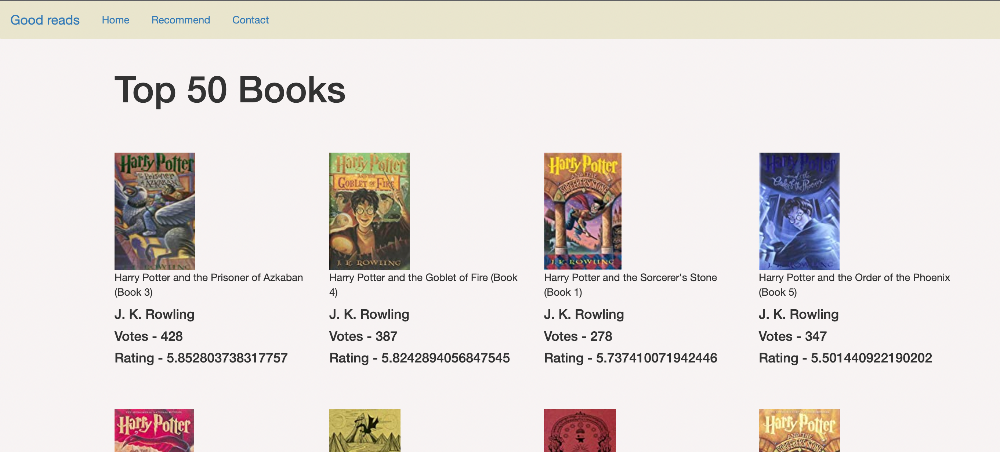
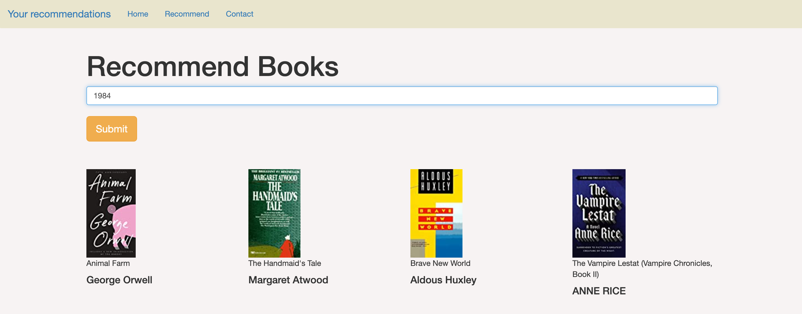
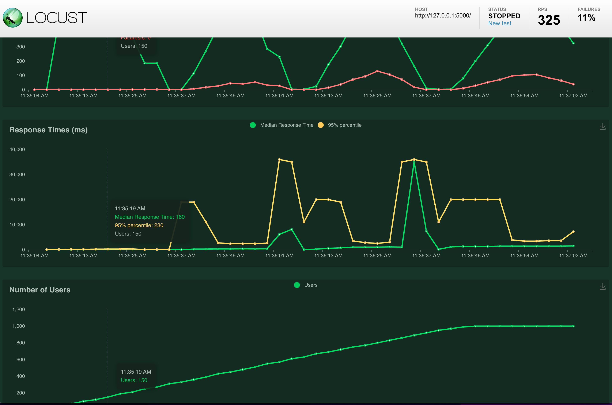

# Book Recommendation System
need summary here (Collab filtering used, approach good reads data, etc.) ----- add in later

## Demo of Application

## Getting Started
1. 
2. 

## Application UI/UX
Home Page

Recommendation Page & Results

## Locust Load Test

